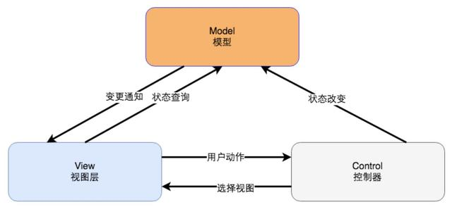
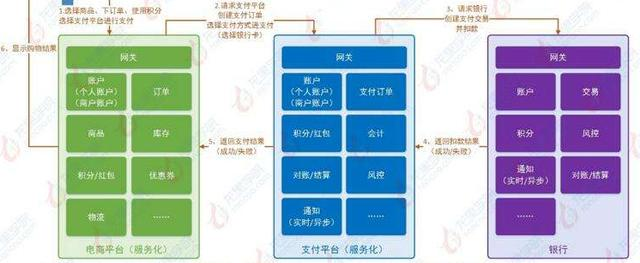
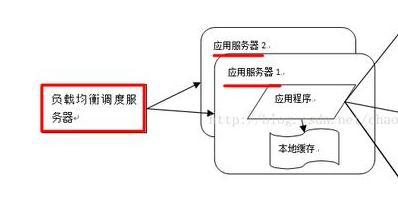
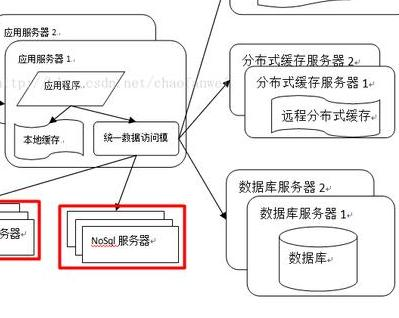

9种高性能高可用高并发的技术架构

每一个模式描述了一个在我们周围不断重复发生的问题及该问题解决方案的核心。这样，你就能一次又一次地使用该方案而不必做重复工作。 所谓网站架构模式即为了解决大型网站面临的高并发访问、海量数据、高可靠运行等一系列问题与挑战。为此，在实践中提出了许多解决方案，以实现网站高性能、高可靠性、易伸缩、可扩展、安全等各种技术架构目标。

1、分层
分层是企业应用系统中最常见的一种架构模式，将系统在横向维度上切分成几个部分，每个部分负责一部分相对简单并比较单一的职责，然后通过上层对下层的依赖和调度组成一个完整的系统。

在网站的分层架构中，常见的为3层，即应用层、服务层、数据层。

应用层，具体负责业务和视图的展示；

服务层，为应用层提供服务支持；

数据层，提供数据存储访问服务，如数据库、缓存、文件、搜索引擎等。

分层架构是逻辑上的，在物理部署上，三层架构可以部署在同一个物理机器上，但是随着网站业务的发展，必然需要对已经分层的模块分离部署，即三层结构分别部署在不同的服务器上，使网站拥有更多的计算资源，以应对越来越多的用户访问。

所以，虽然分层架构模式最初的目的，是规划软件清晰的逻辑结构，以便于开发维护。但在网站的发展过程中，分层结构对网站支持高并发，向分布式方向的发展至关重要。

2、冗余
网站需要7×24小时连续运行，那么就得有相应的冗余机制，以防某台机器宕掉时无法访问，而冗余则可以通过部署至少两台服务器构成一个集群实现服务高可用。数据库除了定期备份还需要实现冷热备份。甚至可以在全球范围内部署灾备数据中心。

3、分隔
如果说分层是将软件在横向方面进行切分，那么分隔就是在纵向方面对软件进行切分。

网站越大，功能越复杂，服务和数据处理的种类也越多，将这些不同的功能和服务分隔开来，包装成高内聚低耦合的模块单元，不仅有助于软件的开发维护也便于不同模块的分布式部署，提高网站的并发处理能力和功能扩展能力。

大型网站分隔的粒度可能会很小。比如在应用层，将不同业务进行分隔，例如将购物、论坛、搜索、广告分隔成不同的应用，有对立的团队负责，部署在不同的服务器上。

4、异步
使用异步，业务之间的消息传递不是同步调用，而是将一个业务操作分成多个阶段，每个阶段之间通过共享数据的方法异步执行进行协作。

具体实现则在单一服务器内部可用通过多线程共享内存的方式处理；在分布式系统中可用通过分布式消息队列来实现异步。

异步架构的典型就是生产者消费者方式，两者不存在直接调用。

5、分布式
对于大型网站，分层和分隔的一个主要目的是为了切分后的模块便于分布式部署，即将不同模块部署在不同的服务器上，通过远程调用协同工作。分布式意味着可以使用更多的计算机完同样的工作，计算机越多，CPU、内存、存储资源就越多，能过处理的并发访问和数据量就越大，进而能够为更多的用户提供服务。

在网站应用中，常用的分布式方案有一下几种.

分布式应用和服务：将分层和分隔后的应用和服务模块分布式部署，可以改善网站性能和并发性、加快开发和发布速度、减少数据库连接资源消耗。

分布式静态资源：网站的静态资源如JS、CSS、Logo图片等资源对立分布式部署，并采用独立的域名，即人们常说的动静分离。静态资源分布式部署可以减轻应用服务器的负载压力；通过使用独立域名加快浏览器并发加载的速度。

分布式数据和存储：大型网站需要处理以P为单位的海量数据，单台计算机无法提供如此大的存储空间，这些数据库需要分布式存储。

分布式计算：目前网站普遍使用Hadoop和MapReduce分布式计算框架进行此类批处理计算，其特点是移动计算而不是移动数据，将计算程序分发到数据所在的位置以加速计算和分布式计算。

6、安全
网站在安全架构方面有许多模式：通过密码和手机校验码进行身份认证；登录、交易需要对网络通信进行加密；为了防止机器人程序滥用资源，需要使用验证码进行识别；对常见的XSS攻击、SQL注入需要编码转换；垃圾信息需要过滤等。

8、自动化
具体有自动化发布过程，自动化代码管理、自动化测试、自动化安全检测、自动化部署、自动化监控、自动化报警、自动化失效转移、自动化失效恢复等。

8、集群
对于用户访问集中的模块需要将独立部署的服务器集群化，即多台服务器部署相同的应用构成一个集群，通过负载均衡设备共同对外提供服务。

服务器集群能够为相同的服务提供更多的并发支持，因此当有更多的用户访问时，只需要向集群中加入新的机器即可；另外可以实现当其中的某台服务器发生故障时，可以通过负载均衡的失效转移机制将请求转移至集群中其他的服务器上，因此可以提高系统的可用性。

9、缓存
缓存目的就是减轻服务器的计算，使数据直接返回给用户。在现在的软件设计中，缓存已经无处不在。具体实现有CDN、反向代理、本地缓存、分布式缓存等。

使用缓存有两个条件：访问数据热点不均衡，即某些频繁访问的数据需要放在缓存中；数据在某个时间段内有效，不过很快过期，否在会因为数据过期而脏读，影响数据的正确性。

