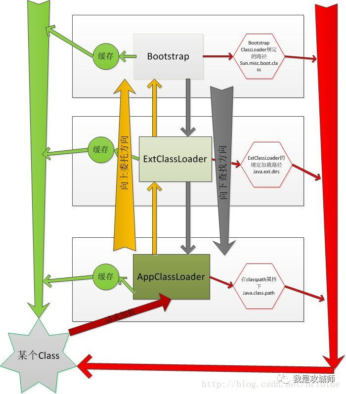
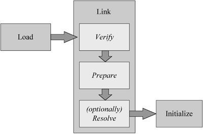

## Java类加载机制

从广义的概念上Java语言里面只有两种类加载器：

（1）Bootstrap CLassloder（引导类加载器）

（2）User Define Classloader（用户自定义的类加载器）

### Java类加载器的双亲委派机制
（1）自定义类加载器或者当前的类加载器先判断该类是否已经加载过，如果加载过 直接返回，否则就委托父加载器进行加载。

（2）父加载器重复（1）步骤，先判断是否加载过，如果加载过直接返回 否则，继续递归重复（1）步骤

（3）如果父加载器为null，那么会委托引导类加载器进行查询，如果已经加载过，那么直接返回，否则就在当前类加载器的路径下面查询，如果仍然找不到就返回上一级，上一级也就执行同样的步骤。

（4）最终都没有找到，会在自定义的类加载器路径下面查找，如果找到了就返回，否则就抛出相关的类找不到异常。



### 双亲委托的模型的意义与破坏

首先双亲委托模型并不是强制约束，而是 Java设计者推荐给开发者的类加载器实现方式，在Java 的世界中大部分的类加载器都遵循这个模型。双亲委派模型对于保证Java程序的安全稳定运作很重要，其最大的意义就在于提升了Java平台运行的安全稳定性，为什么这么说？

因为双亲委托模型使得Java类随着它的类加载器一起具备了带有优先级的层次关系，在加载一个类的时候，如果准守这个模型，那么必定会先从处于模型最顶端的引导类加载器查询加载，因此就能保证对于一些基础类如Object，在不同的类加载器环境中使用的都是同一个类，但如果没有这个模型，比如黑客定义了一个Object类，或者说你自己定义了多个Object类，那么在使用时候会加载多份，那系统中将会出现多个不同的Object类，Java 类型体系中最基础的行为也就无法保证，应用程序也将会变得一片混乱和非常不安全。

举个常见的例子： Java里面的SPI机制，或者java.sql的驱动实例化的例子，他们的核心接口都是由Java的引导类加载器加载的，但是他们的实现却是各个厂商提供的或者根据约定设置的，这种情况下引导类加载器是看不到底层加载器的（classpath）的类的，所以只能通过底层加载器本身来加载，这个时候相当于顶层加载器需要使用底层加载器加载的类，从而间接的破坏了双亲委托模型，相当于走了后门。

另外一种破坏双亲委托模型的例子是热加载模式，为了解决不停机或者不停服务更新应用，典型的应用场景是在OSGI里面，默认情况下对于已经加载的类双亲委派模型是不会重新再加载的，但这样就意味着更新了不会被及时感知，如果需要做到动态更新，那么对于已经加载的类也必须再次进行加载，并且要处理好旧实例与新实例状态数据拷贝问题，这种模式也是破坏了双亲委派机制。

### 类加载系统的阶段流程与类的生命周期

(1) 初始化阶段

在生命周期的开始阶段又分三个过程分别是load，link，initialize

(2) 中期阶段

在生命周期的中间阶段包括对象实例化，垃圾收集和终结的过程

(3) 销毁阶段

在生命周期的尾部阶段，也就是虚拟机退出时类需要被unload卸载。



load过程可以简单认为是通过指定类的全限定名，将磁盘上或者任意位置上二进制的class文件解析成了java的内部的数据结构并存储在了堆内存中的方法区，之后又创建了Class类的实例来代表该类型。

然后是link步骤，这个过程又分为3个子不走，首先通过verify检验class文件的格式是否符合JVM实现规范，然后在prepare步骤，会给类的静态字段赋默认值，并分配内存空间，这个步骤并不会执行任何Java代码，仅仅给静态字段赋默认值。resolve步骤是可选的，这一步会将类里面的符号引用替换为真实引用。

最后到初始化阶段initialize对应的jvm底层调用的clinit指令，这个时候会执行静态块以及对静态字段赋值我们指定的默认值。

当第一次使用某个类的时候，才会触发某个类的初始化行为，这里有六种情况：

（1）有new操作符出现的时候，或者隐式的条件，包括反射，克隆，反序列化等。

（2）调用了类的静态方法

（3）使用了某个类的通过static修饰的类，字段或者接口（final除外，因为final语句是编译时常量，其初始化在编译时就确定了）

（4）通过反射调用类里面的相关方法

（5）子类初始化会触发父类初始化

（6）执行了类本身的main方法

对于load，link，initalize的顺序，必须是顺序的，也就是或一个类要被初始化，那么它必须被link，如果一个类想要被link，那么它必须先被load。

```
Class.forName("SomeClass"); 

ClassLoader.getSystemClassLoader().loadClass("SomeClass");
```
第一种使用的是反射了一个类，第二种是使用类加载器加载了一个类。

反射的底层执行方法是：
```
Class.forName(className, true, currentLoader)
```
第二个方法代表要不要初始化该类的静态变量和执行静态块。  
而类加载器的loadClass方法底层执行的是：  
```
loadClass(name, false)
```
第二个参数与初始化无关，仅仅是加载的时候是否需要执行relove解析符号引用为直接引用。

所以使用反射的话默认是执行了类加载器初始化阶段的三个步骤包括load，link，initialize。

而直接使用ClassLoader.loadClass()方法仅仅是执行类加载器初始化阶段的两个步骤包括load，link，但是并没有执行intialize步骤，这一点需要注意。

典型的例子就是使用JDBC驱动的时候， 我们是通过反射初始化的。如果是通过类加载器加载的类是没有初始化的。

### 关于类的初始化顺序
如果类还没有被加载： 
1、先执行父类的静态代码块和静态变量初始化，并且静态代码块和静态变量的执行顺序只跟代码中出现的顺序有关。 
2、执行子类的静态代码块和静态变量初始化。 
3、执行父类的实例变量初始化 
4、执行父类的构造函数 
5、执行子类的实例变量初始化 
6、执行子类的构造函数 

如果类已经被加载： 
则静态代码块和静态变量就不用重复执行，再创建类对象时，只执行与实例相关的变量初始化和构造方法。

###参考：
https://cloud.tencent.com/developer/article/1356114

