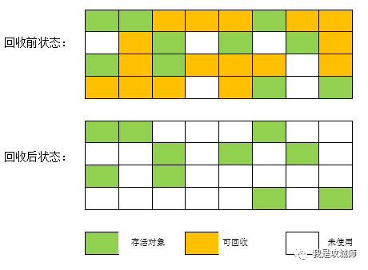
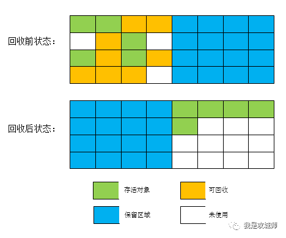
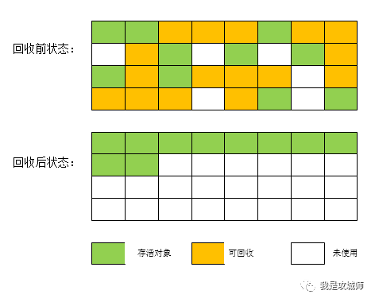
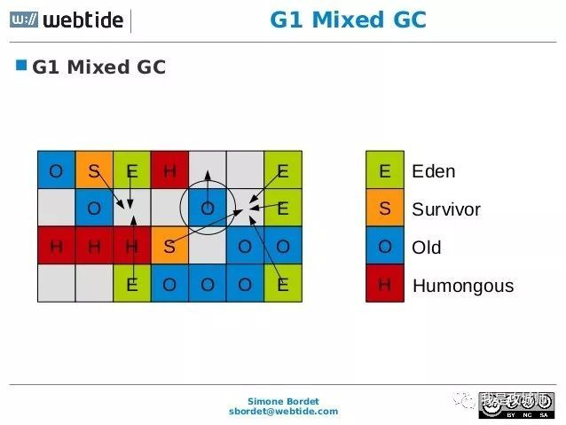

## JVM垃圾回收

### 什么时候回收
>>当Eden区和From Survivor区满时；

>>调用System.gc时，系统建议执行Full GC，但是不必然执行

>>老年代空间不足

>>方法区空间不足

>>通过Minor GC后进入老年代的平均大小大于老年代的可用内存

>>由Eden区、From Space区向To Space区复制时，对象大小大于To Space可用内存，则把该对象转存到老年代，且老年代的可用内存小于该对象大小

### 如何判断对象需要回收
（一）引用计数算法

给对象中添加一个引用计数器，每当有一个地方引用时就加1，当引用失效时就减1，任何时候计数器为0的对象就是不可能再使用的。思想和实现都比较简单，效率也比较高，在大部分情况下都不错，但Java语言却没有选择它来管理内存，最大的原因就是因为它比较难解决对象之间相互引用的问题。

优点:实现简单效率高，被广泛使用与如python何游戏脚本语言上。
缺点:难以解决循环引用的问题，就是假如两个对象互相引用已经不会再被其它其它引用，导致一直不会为0就无法进行回收。

（二）根搜索算法

根搜索算法（GC Roots Tracing）的基本思路就是通过一系列名为 “ GC Roots ”的对象为起点，然后开始向下搜索，搜索所走过的路径称为引用链，当一个对象到GC Roots没有任何引用链（在图里面称为路径）时，则证明此对象是不可达的。

可作为GC Roots的对象有四种
```
①虚拟机栈(栈桢中的本地变量表)中的引用的对象，就是平时所指的java对象，存放在堆中。
②方法区中的类静态属性引用的对象，一般指被static修饰引用的对象，加载类的时候就加载到内存中。
③方法区中的常量引用的对象,
④本地方法栈中JNI（native方法)引用的对象
```

（三）Java里面引用的种类

一个对象如果只有引用和非引用两种状态，那么可能有点太生硬，对于一些可有可无的对象就没法描述。比如缓存里面的对象，所以在JDK1.2之后对引用的概念进行了扩充，分别四种：

```
（1）强引用（Strong Reference） 通过new实例化的对象

（2）软引用（Soft Reference）在内存即将发生溢出前，会把这些对象回收

（3）弱引用（Weak Reference）在下一次垃圾收集发生之前，会被回收

（4）虚引用（Phantom Reference）一个对象是否有虚引用的存在，不会对其生存时间构成影响，也无法通过 虚引用来取得一个对象实例，设置虚引用的目的就是希望这个对象被收集器回收时收到一个系统通知
```

（四）对象的自救

宣布一个对象死亡时，至少要经历两次标记过程，触发GC之前会执行finalize方法，如果我们重写了这个方法，在这里又重新引用一个对象，那么就不会被回收，但这么做没有什么意义，借用深入理解虚拟机的作者的话，大家可以完全忘掉这个方法的存在，绝大多数是用不到的。

```
要真正宣告对象死亡需经过两个过程。
1.可达性分析后没有发现引用链
2.查看对象是否有finalize方法，如果有重写且在方法内完成自救[比如再建立引用]，还是可以抢救一下，注意这边一个类的finalize只执行一次，这就会出现一样的代码第一次自救成功第二次失败的情况。[如果类重写finalize且还没调用过，会将这个对象放到一个叫做F-Queue的序列里，这边finalize不承诺一定会执行，这么做是因为如果里面死循环的话可能会时F-Queue队列处于等待，严重会导致内存崩溃，这是我们不希望看到的。]
```

（五）关于方法区

方法区一般是永久代，JVM规范上也不要求回收这个区域的数据，因为性价比太低，主要是一些废弃常量和无用的类。但是如果存储的数据大于了方法区的大小，这个区域依然是会报内存溢出异常的。


### 哪些内存要回收
java内存模型中分为五大区域已经有所了解。我们知道`程序计数器`、`虚拟机栈`、`本地方法栈`，由线程而生，随线程而灭，其中栈中的栈帧随着方法的进入顺序的执行的入栈和出栈的操作，一个栈帧需要分配多少内存取决于具体的虚拟机实现并且在编译期间即确定下来【忽略JIT编译器做的优化，基本当成编译期间可知】，当方法或线程执行完毕后，内存就随着回收，因此无需关心。

而`Java堆`、`方法区`则不一样。方法区存放着类加载信息，但是一个接口中多个实现类需要的内存可能不太一样，一个方法中多个分支需要的内存也可能不一样【只有在运行期间才可知道这个方法创建了哪些对象没需要多少内存】，这部分内存的分配和回收都是动态的，gc关注的也正是这部分的内存。

###  堆的回收区域

为了高效的回收，jvm将堆分为三个区域
1.新生代（Young Generation）NewSize和MaxNewSize分别可以控制年轻代的初始大小和最大的大小
2.老年代（Old Generation）
3.永久代（Permanent Generation）【1.8以后采用元空间，就不在堆中了】

### 垃圾回收算法

（1）标记-清除

先标记出所有需要回收的对象，在标记完成后统一回收掉被标记的对象。

这是垃圾回收算法的基础，后面的几种基本都是对这种思路的优化，

这种算法主要问题是：首先效率一般，此外清除之后存在大量的不连续的内存碎片，空间碎片如果太多，可能再下一次申请一个大的对象时而无法分配到可容纳的内存，就会触发另一次垃圾收集动作。



（2）标记-复制

为了解决效率问题，另外一种基于复制的思想就出现了，它将可用内存分为大小相等的两块，每次只使用其中的一块。当这一块用完了，就存活着的对象复制到另外一块上面，然后在把前一块已经使用过的内存空间一次清理掉，这样使得每次都是对其中的一块进行内存回收，而且分配时也不用考虑内存碎片等复杂情况，只需要移动堆顶指针按顺序分配内存即可，实现简单，运行高效，唯一的缺点是内存利用率变为原来的一半。因为这个问题，所以适合用在新生代内存，降低内存的浪费情况。

在CMS垃圾收集器中，新生代里面分为一个Eden区和两个survivor区，默认Eden与survivor区的占比是8:1:1，也就是说新生代中，内存利用的有效率为80%+10%=90%，仅有10%是浪费掉的。当然并不是每次存活的对象会低于10%，如果大于10%，那么这些对象就会通过分配担保机制进入老年代。在经历一次新生代GC后，后入新到来的对象如果eden区能够容纳，仍然会放在新生代中。



（3）标记-整理

复制收集算法在对象存活率较高的情况，需要执行很多次复制操作，效率将会变低，再一点内存浪费有点严重，所以老年代一般不能使用这种算法。

所以就诞生出来了在（1）的基础上优化的算法，与标记-清除一样，但后续不是直接对可回收对象进行清除，而是将所有存活的对象都向一端移动，然后直接清理掉端末的内存即可。



（4）分代收集

当前商业的虚拟机的垃圾收集采用的都是分带收集算法，这种算法没有什么新思想，只是根据对象存活周期的不同将内存划为几块，

一般将JVM分为新年代和老年代，新生代对象生命周期短就采用复制算，只需要付出少量存活对象的复制成本就可以完成收集，而老年代对象存活率高且没有额外的空间进行分配担保，所以必须使用标记-清除或者标记整理算法来回收。

### 垃圾收集器

（1）Serial收集器：单线程串行收集，在工作时候会执行STW（Stop The World）动作直到收集完毕,一般用在虚拟机运行在Client模式下的默认新生代收集器。

（2）ParNew其实是Serial收集器的多线程版本，收集算法，STW，对象分配规则，回收策略都一样

（3）Parallel Scavenge是一个新生代的收集器，使用的是复制算法的并行收集器

（4）Serial-Old是Serial的老年代版本，同样是单线程，但采用的是 标记-整理算法。有两个用途在JDK5之前与Parallel Scavenge收集器搭配使用；另外在CMS并发收集发生Concurrent Mode Failure时作为CMS收集器的后备预案。

（5）Parallel Old是Parallel Scavenge的老年代版本，使用多线程和标记整理算法，偏向于吞吐量及CPU资源敏感的场景下。

（6）CMS（Concurrent Mark Sweep）收集器是倾向于响应速度，适合于用在B/S系统的服务器上，从名字上能看出这种算法是基于标记-清除算法实现的，但是也有参数控制是否在清除阶段后整理内存碎片。 

其收集分4个步骤：
```
初始标记->并发标记->重新标记->并发清除

其中初始标记和重新标记这两个步骤仍然需要STW，

初始标记仅仅只是标记一下GC Roots能直接关联到的对象，速度很快，

并发标记就是GC Tracing的过程，而重新标记是为了修正并发标记期间，用户程序继续运行导致部分发生变动的对象记录。

感觉有点像StampLock锁里面乐观读的意思，整个过程耗时最长的在并发标记和并发清除的过程，收集线程可以与用户线程一起工作，总的来说回收过程是并发的。
```

CMS的缺点：
```
6.1 CMS收集器对CPU敏感，回收过程中可能会抢占用户线程的资源

6.2 CMS收集器无法处理浮动垃圾，可能会导致Concurrent Mode Failure失败而导致另一次Full GC发生。

因为收集过程是并发的，在标记之后，新产生的垃圾，CMS无法在本次处理掉他们，只好等下一次GC时清理。

由于用户线程和垃圾收集线程并发执行，所以CMS还需要给用户线程预留一部分内存使用，所以不会像其他的收集器一样，等到老年代满了才触发GC，

默认情况下当使用空间超过68%就会被激活，这个可以通过参数控制，如果预留的内存无法满足需要，就会出现一次Concurrent Mode Failure失败，这个时候虚拟机启动预备方案，临时启动Serial Old来重新进行老年代的垃圾收集，这样停顿时间就长了。所以这个参数尽量不要修改。

6.3 因为是CMS主要基于标记-清除算法，所以在收集结束时会产生大量空间碎片，如果碎片太多，将会给大对象的分配带来很大麻烦，如果分配不了，则会再次出发Full GC，所以CMS提供了一个参数可控制多久一次内存整理，当然这个过程是需要STW的。
```

（7）G1收集器是在JDK1.7中正式发布的，相比CMS有两个大的改进：

第一G1收集器是基于标记-整理算法实现的，也就说不会产生内存碎片。

第二可以比较精确的控制停顿时间，其主要原因是G1算法，将Java堆切成了很多个 大小固定的区域，并跟踪这些区域里面的垃圾堆积程序，在后台维护一个优先列表，每次根据允许的收集时间，优先回收垃圾最多的区域，区域划分优先度之后，就能保证其在有限时间内获得最大的收集效率。如果区域放不下单个大对象的时候，就会合并多个区域，有可能引发Full GC。



### 对象分配机制

（1）大多是时候，新对象优先在新生代Eden分配，如果这个空间满了，那么就会触发一次minor gc，我们通过-XX:+PrintGCDetail这个收集器参数可以打印gc日志。

（2）如果是一个大对象（需要大量连续的内存空间）通常指的是数组，可以通过参数控制超过多少，直接进入老年代而不需要经过新生代。

（3）长期存活在新生代的对象，如果age超过了指定的计数器，默认是经过15次Ygc，就会晋升到老年代。

（4）动态对象年龄判定，虚拟机并不总是要求对象的年龄到达15才回收，如果survivor空间中相同年龄所有对象的大小的总和大于survivor空间的一般，年龄大于等于该年龄对象也可以直接进入老年大。无须等到默认的15次。

（5）空间分配担保

在发生Minor GC之前，虚拟机会检测老年代最大可用的连续空间是否大于新生代所有对象的总空间，

如果大于，则认为进行Minor GC是安全的，如果小于，则虚拟机会查看HandlePromotionFailure设置值是否允许担保失败，

如果允许，那么继续坚持老年代的最大可用连续空间是否大于以前晋升到老年代对象的平均大小，

如果大于，则安全的执行minor gc，但这是有风险的，因为平均值不能代表突变的峰值，如果不允许，那就执行一次FGC回收空间。


### 参考：

https://cloud.tencent.com/developer/article/1356059
https://www.cnblogs.com/xingzc/p/5756119.html
https://www.jianshu.com/p/76959115d486