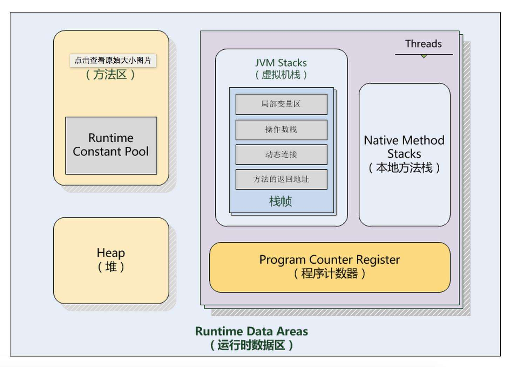
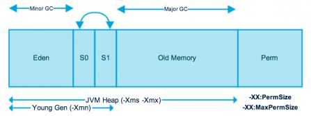
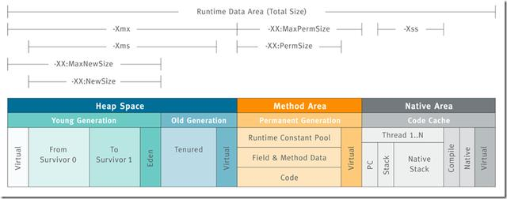

##JVM内存模型

Java数据区域分为五大数据区域, 分别是：PC程序计数寄存器（program counter register），虚拟机栈（Stack），堆（Heap），方法区和本地方法栈



### （一）PC程序计数寄存器（线程私有）
我们知道对于一个处理器(如果是多核cpu那就是一核)，在一个确定的时刻都只会执行一条线程中的指令，一条线程中有多个指令，为了线程切换可以恢复到正确执行位置，每个线程都需有独立的一个程序计数器，不同线程之间的程序计数器互不影响，独立存储。

注意：如果线程执行的是个java方法，那么计数器记录虚拟机字节码指令的地址(returnAddress)。如果为native【底层方法】，那么计数器为空（未定义）。这块内存区域是虚拟机规范中唯一没有OutOfMemoryError的区域。

### （二）虚拟机栈Stack（线程私有）
同计数器也为线程私有，生命周期与线程相同，就是我们平时说的栈，栈描述的是Java方法执行的内存模型。

每个方法被执行的时候都会创建一个栈帧用于存储局部变量表，操作栈，动态链接，方法出口等信息。每一个方法被调用的过程就对应一个栈帧在虚拟机栈中从入栈到出栈的过程
```
栈帧: 是用来存储数据和部分过程结果的数据结构。
栈帧的位置:  内存 -> 运行时数据区 -> 某个线程对应的虚拟机栈 -> here[在这里]
栈帧大小确定时间: 编译期确定，不受运行期数据影响。
```

平时说的栈一般指局部变量表部分。

```
局部变量表:一片连续的内存空间，用来存放方法参数，以及方法内定义的局部变量，存放着编译期间已知的数据类型(八大基本类型和对象引用(reference类型),returnAddress类型。它的最小的局部变量表空间单位为Slot，虚拟机没有指明Slot的大小，但在jvm中，long和double类型数据明确规定为64位，这两个类型占2个Slot，其它基本类型固定占用1个Slot。

reference类型:与基本类型不同的是它不等同本身，即使是String，内部也是char数组组成，它可能是指向一个对象起始位置指针，也可能指向一个代表对象的句柄或其他与该对象有关的位置。

returnAddress类型:指向一条字节码指令的地址
```

需要注意的是，局部变量表所需要的内存空间在编译期完成分配，当进入一个方法时，这个方法在栈中需要分配多大的局部变量空间是完全确定的，在方法运行期间不会改变局部变量表大小。

```
栈上可能发生的异常：

（1）如果线程的计算需要更大的栈，超过了设定的值，那么会抛出： StackOverflowError

（2）如果栈可以被动态的扩展，但是现在没有足够的内存用于扩展或者栈的内存已经不足于在创建一个新的线程，那么会抛出： OutOfMemoryError
```

### （三）堆Heap（线程共享）
JVM里面的堆内存是被所有线程共享的，堆里面存的数据主要是所有的类实例和数组，堆在虚拟机启动时创建，严格的说这块内存属于JVM进程的，对象只能显式的创建，但是不能显式的销毁。  
这一点与C语言不同，Java自动管理内存回收是通过GC（garbage collector）来实现的，堆里面的内存是通过gc回收的，堆的内存也是不需要连续的，在gc时候会自动整理碎片，回收掉无用的对象。

堆内存是所有线程共有的，可以分为两个部分：年轻代和老年代。

下图中的Perm代表的是永久代，但是注意永久代并不属于堆内存中的一部分，同时jdk1.8之后永久代已经被移除。



堆（Heap）是java虚拟机所管理的内存中`最大的`一块内存区域，也是被各个`线程共享`的内存区域，该内存区域存放了`对象实例及数组（但不是所有的对象实例都在堆中）`。

其大小通过`-Xms`(最小值)和`-Xmx`(最大值)参数设置，前者为启动时申请的最小内存，默认为操作系统物理内存的1/64，后者为JVM可申请的最大内存,默认为物理内存的1/4。

默认当`空余堆内存小于40%`时，JVM会`增大`堆内存到-Xmx指定的大小，可通过-XX:MinHeapFreeRation=来指定这个比列；当`空余堆内存大于70%`时，JVM会`减小`堆内存的大小到-Xms指定的大小，可通过XX:MaxHeapFreeRation=来指定这个比列，当然为了避免在运行时频繁调整Heap的大小，通常-Xms与-Xmx的值设成一样。

堆内存 = 新生代+老生代+持久代。在我们垃圾回收的时候，我们往往将堆内存分成新生代和老生代（大小比例1：2），新生代中由Eden和Survivor0，Survivor1组成，`三者的比例是8：1：1`。

新生代的回收机制采用`复制算法`，在Minor GC的时候，我们都`留一个存活区用来存放存活的对象`，真正进行的区域是Eden+其中一个存活区，当我们的对象时长超过一定年龄时（默认`15`，可以通过参数设置），将会把对象放入老生代，当然大的对象会直接进入老生代。

老生代采用的回收算法是`标记整理算法`。

```
堆的大小可以是固定的，也可以是动态扩展的，如果计算所需要的内存大于了当前分配的有效内存，那么会抛出： OutOfMemoryError
```

### （四）方法区（包含在堆里面，线程共享）
方法区也称"永久代"，它用于存储虚拟机加载的`类信息、常量、静态变量`，是各个`线程共享的内存区域`。

默认最小值为16MB，最大值为64MB（64位JVM由于指针膨胀，默认是85M），可以通过-XX:PermSize 和 -XX:MaxPermSize 参数限制方法区的大小。

它是`一片连续的堆空间`，永久代的垃圾收集是和老年代(old generation)捆绑在一起的，因此无论谁满了，都会触发永久代和老年代的垃圾收集。

不过，一个明显的问题是，当JVM加载的类信息容量超过了参数-XX：MaxPermSize设定的值时，应用将会报OOM的错误。参数是通过-XX:PermSize和-XX：MaxPermSize来设定的

运行时常量池(Runtime Constant Pool)：是方法区的一部分，Class文件中除了有类的版本、字段、方法、接口等描述信息外，还有一项信息是常量池，用于存放`编译器生成的各种符号引用`，这部分内容将在类加载后放到方法区的运行时常量池中。

从JDK7开始移除永久代（但并没有移除，还是存在），贮存在永久代的一部分数据已经转移到了Java Heap或者是Native Heap：符号引用(Symbols)转移到了native heap;字面量(interned strings)转移到了java heap;类的静态变量(class statics)转移到了java heap。

从JDK8开始使用元空间（Metaspace），元空间的大小受本地内存限制，新参数（MaxMetaspaceSize）用于限制本地内存分配给类元数据的大小。如果没有指定这个参数，元空间会在运行时根据需要动态调整。

### （五）本地方法栈（Native Method Stacks线程私有）
这个栈大多数虚拟机实现的时候基本会和JVM虚拟机栈合并，所以有可能存在也有可能不存在，通常是用C语言编写的，用来支持Java的native方法。
```
在内存不足时，会抛出异常StackOverflowError和OutOfMemoryError。
```

### 直接内存
直接内存并不是虚拟机内存的一部分，也不是Java虚拟机规范中定义的内存区域。

jdk1.4中新加入的NIO，引入了通道与缓冲区的IO方式，它可以调用Native方法直接分配堆外内存，这个堆外内存就是本机内存，不会影响到堆内存的大小.


